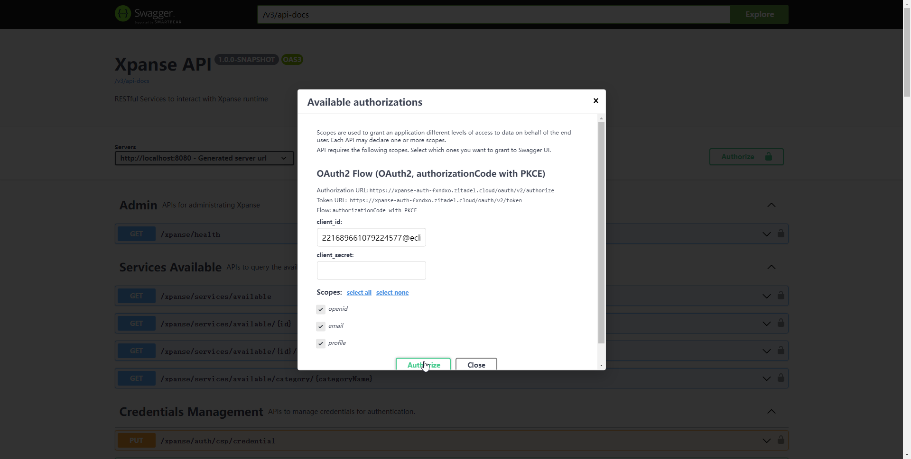

# Authentication and Authorization

With security being at the heart of Xpanse project, all entry points to the application are completely protected.

## OIDC

Authentication and Authorization are implemented using OIDC (OpenID Connect). This helps us to outsource the security
layer to an external `Identity Provider` and thereby not storing any user data within Xpanse.

### OIDC Providers and its Configuration

Similar to other integrations provided in Xpanse, the runtime can be extended to be integrated with any Identity
Provider that supports OIDC standards. It is not limited to any specific product.

Any OIDC provider cannot be used directly out of the box. It needs a variety of configurations on the provider. From
Xpanse project, we aim to provide 'Infrastructure as Code' which will automate all required configuration on the
Identity provider.

All Identity provider related configuration on consumers can only be obtained only after the OIDC provider is fully
configured with the consumer detail

## Zitadel

As a default implementation, Xpanse runtime is integrated with [Zitadel](https://zitadel.com/) Identity Provider.

To enable Zitadel authentication layer, the runtime must be started with `zitadel` profile.

More details can be found [here](runtime.md).

### Zitadel Provider Configuration

After starting the vanilla Zitadel application, all required configurations can be applied using the Terraform scripts
provided.
All steps required for initial configuration are
available [here](https://github.com/eclipse-xpanse/xpanse-iam/blob/main/zitadel/terraform/README.md).

### Zitadel Consumer Configuration

All generated configuration details can be obtained as
documented [here](https://github.com/eclipse-xpanse/xpanse-iam/blob/main/zitadel/terraform/README.md#get-consumer-details).

#### Runtime

Runtime application needs the following properties to be set for the authentication and authorization to work.

-   authorization-server-endpoint
-   authorization-api-client-id
-   authorization-api-client-secret
-   authorization-swagger-ui-client-id

#### UI

UI can be then started using the consumer details as
documented [here](ui.md#starting-local-development-server).

#### End Users Configuration

At the moment, it is only feasible to create user only via the Zitadel UI as we do not have SMTP available which is
needed for self-registration of users.

#### Admin Users

By default, Zitadel provides a root user using which other users can be created and also made other administrators. Only
these users can add other end-users on Zitadel.

## Role Based Access Control - RBAC

We use OIDC providers to also implement RBAC on Xpanse runtime API and also in UI.

### Roles

To keep our initial role configuration simple, the following roles are considered

> `user` - this is the role allocated to end user.
>
> `csp` - this is the role allocated to cloud service provider users.
>
> `admin` - this is the role allocated to administrators running Xpanse.
>
> **Default Role** - When no roles are assigned to a user, then every registered is by default assumed to have
> the `user` role.

### Role Assignment

After the end users are registered/created on Zitadel, the administrator must assign roles to the user.

This option can be found on the UI under - users -> click on user -> Authorizations -> + New

### Role Validation

1. Each API method is configured to be allowed only for specific roles. `Spring Security` fetches the user information
   from `Identity Provider` and based on the roles allocated to the user, we decide if the user is allowed to access an
   API or not. If the user is not authorized to access, then API returns HTTP code `403`.
2. Xpanse UI fetches the user information from `Identity Provider` and based on the roles allocated to the user, menu
   options are displayed in the UI.

### Execute authenticated APIs

When the application has activated authorization with 'zitadel' profile, all protected APIs must have an
`Authorization` header in the `Bearer ${access token}` format in the http request.
Here are two ways to get access_token for executing authenticated APIs:

The first way is to open the Swagger-UI page of the Xpanse server.
In case of local development server, the Swagger-UI is reachable on `http://localhost:8080/swagger-ui/index.html`.

Click on the 'Authorize' button on the SwaggerUI page to open the authentication window.
Click on the 'select all' option to select all 'Scopes' and click on 'Authorize'

The browser will redirect to the login page of the IAM service.
Fill username and password to complete user login.
Once the login is successful, the control is automatically redirected to the Swagger-UI page.
Close the authentication window and select the API which you want to execute and click to expand it,
then click on 'Try it out' and 'Execute' to execute the API method.
In the Curl command, you can see the request header named `Authorization` with the value of
${access_token} after prefix `Bearer `.

The other way is to use the `Authorize` REST API.
Call the method using browser.
In case of local development server, the URL is `http://localhost:8080/auth/authorize`.
The browser will redirect to the login page of the IAM service.
Fill username and password to complete user login.
After successful login in the IAM, the browser will back to the token API
url with response model 'TokenResponse' with field 'access_token.'
Then you can use the value of 'access_token' to fill header 'Authorization' in the http request when executing
authenticated APIs with CLI or the other http client tools.

